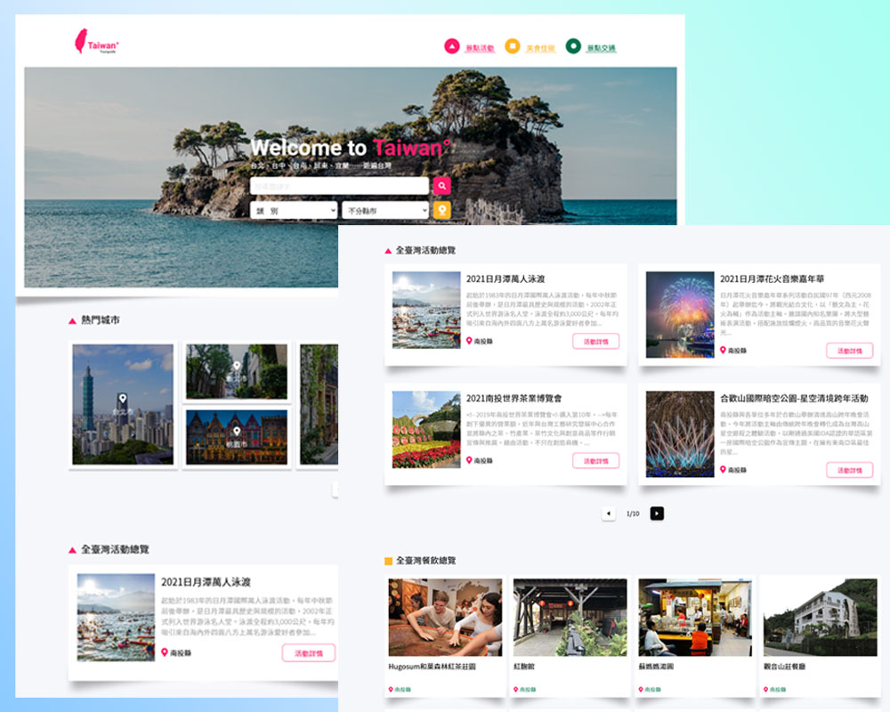
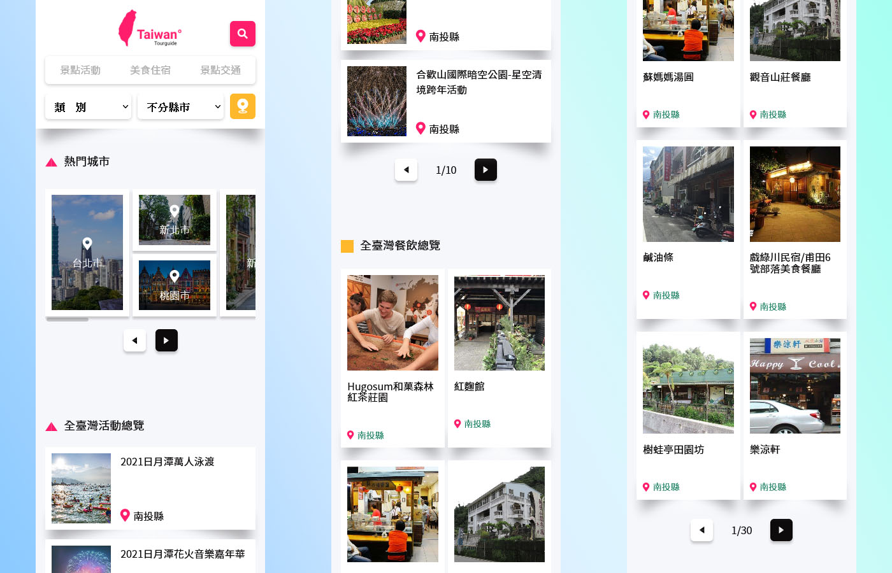

# The-F2E-3rd 修練精神時光屋第三屆－Week1 台灣旅遊景點導覽

這是來自[The-F2E-3rd](https://2021.thef2e.com/)的一個挑戰。The-F2E-3rd 是由[六角學院](https://www.hexschool.com/)主辦的一項競賽，主要是要提供給工程師、設計師一個可以練習專業技術的資源。目前 The-F2E 修練精神時光屋已經舉辦了三屆，有興趣的朋友也歡迎到連結中參考看看。

## 大綱

- [總覽](#總覽)
  - [重要訊息](#重要訊息-⚠)
  - [關於這份挑戰](#關於這份挑戰)
  - [螢幕截圖](#螢幕截圖)
  - [網站連結](#網站連結)
- [使用的工具](#使用的工具)
- [關於作者](#關於作者)
- [致謝](#致謝)
- [參考資料](#參考資料)

## 總覽

### 重要訊息 ⚠

#### 2021/11/15

為了確保各位有良好的使用體驗，這邊先做個置頂說明。

目前可以使用的功能：

- 瀏覽首頁、景點活動頁面、美食住宿頁面（每個頁面的初始資料都是以全台灣下去呈現）
- 點擊卡片會跳出視窗，可以瀏覽詳細資料（部分資料中有包含超連結，例如電話、地圖、店家網站）
- 每個區塊都設有分頁功能，可以點擊按鈕來做換頁

目前不可以使用的功能：

- 過濾功能（只能算是半成品。勉強能用，但問題不少）
- 關鍵字搜尋（尚未開始實作）
- 定位功能（尚未開始實作）
- 景點交通頁面（尚未開始實作）

### 關於這份挑戰

這份挑戰是要製作一個台灣旅遊景點導覽的網站，使用者應該要能夠：

- 在各種裝置上都能夠瀏覽該網站（手機、平板、電腦）
- 從清晰的圖文列表來導覽網站內容
- 透過篩選表單，來查看各縣市的的景點、活動、餐廳、旅宿
- 透過定位功能，來顯示附近的相關旅遊資訊
- 查閱交通運輸動態，來查詢想搭乘的公車、客運的相關動態資料

### 螢幕截圖

**🖥 桌機版：**

**📱 手機版：**

### 網站連結

- The-F2E 挑戰連結：[這裡](https://2021.thef2e.com/users/6296432819610583076)
- Demo 網站連結：[這裡](https://jubeatt.github.io/The-F2E-3rd-Travel-Guide/)

### 使用的工具

- [Vue.js](https://v3.vuejs.org/guide/introduction.html)
- CSS Flex-box
- SCSS
- BEM
- ES6
- RWD
- AJAX
- API（TDX 資料串接）

## 關於作者

- Website - [PeaNu's Paradise](https://jubeatt.github.io/)
- Facebook - [個人臉書](https://www.facebook.com/profile.php?id=100003593580513)

## 致謝

要感謝的人有很多，除了主辦單位（六角學院）之外，也謝謝 UI 設計師 [KT](https://2021.thef2e.com/users/6296432819610583177?week=1&type=1) 提供的設計稿，還有各位參賽者們。不論最後比賽的結果如何，我想各位都應該跟我一樣，在這次的比賽中學到了不少東西，我認為這才是最有價值的地方。

提到「修練精神時光屋」這個關鍵字，其實在過去我就略有所聞，不過真正讓我參加這次比賽的契機，是因為剛好在社群中看到了公告，引發了想要嘗試看看的心情。原本的我其實是蠻猶豫要不要參加的，因為自己沒有把握能做出什麼像樣的東西，深怕丟人現眼又打擊自己的自信心 😂。不過，後來還是秉持著一股「總要試試看嘛」的心情，所以還是鐵下心來報名了。當然，我也認為這是一個正確的選擇。

雖然到了最後，我還是沒能在截直日前完成整份專案的目標。不過我明白自己盡力了，也看到自己做到了一些以前做不到的事情，例如說「切一個完整的 RWD 頁面」、「用 API 串接資料」、「用 Vue 做出網站」等。這些看似平凡的前端技術，對我來說卻是一種很大的肯定。

想說的話雖然還有很多，但最重要的一件事情是「即便比賽已經結束，我仍會繼續努力下去。」。我希望自己在接下來的時間，能夠繼續把這份專案給完成，也希望能夠一步一步的優化、新增更多功能等。

學習是永無止盡的，期望各位都能有繼續堅持下去的心，一起成為更好、更棒的人 👍。

## 參考資料

- [Vue3.0 官方文檔](https://v3.vuejs.org/guide/introduction.html)
- [重新認識 Vue.js](https://book.vue.tw/)
- [How to style the option of an html "select" element?](https://stackoverflow.com/questions/7208786/how-to-style-the-option-of-an-html-select-element/7208825)
- [完整解析 CSS 動畫 ( CSS Animation )](https://www.oxxostudio.tw/articles/201803/css-animation.html)
- [預設圖來源](https://dribbble.com/shots/2246883-Collection-list-is-empty)
- [unsplash](https://unsplash.com/s/photos/cat)
- [Font-Awesome](https://fontawesome.com/)
- [Generate a 3-Color-Gradient](https://mycolor.space/gradient3?ori=to+right&hex=%23FF9CD5&hex2=%23B5E8F9&hex3=%23BAEFDD&submit=submit)
- [PTX-公共運輸整合資訊流通服務平台](https://ptx.transportdata.tw/PTX/)
- [Vue 出一個女友吧!-製作分頁邏輯-1](https://hsiangfeng.github.io/vue/20190729/2401395670/)
- [Vue Cli 部署到 Github Pages](https://tzuhui.github.io/2020/03/02/Vue/Vue-CLI3-to-github-pages/)
- [Vue CLI 專案中引入 SCSS 檔案的四種方法，該如何使用呢？](https://medium.com/unalai/vue-%E5%B0%88%E6%A1%88%E4%B8%AD%E5%BC%95%E5%85%A5-scss-%E6%AA%94%E6%A1%88%E7%9A%84%E5%9B%9B%E7%A8%AE%E6%96%B9%E6%B3%95-%E8%A9%B2%E5%A6%82%E4%BD%95%E4%BD%BF%E7%94%A8%E5%91%A2-9babcd3a4ef1)
- [How I Organize My CSS for Websites Without a Framework](https://medium.com/@stephan.romhart/how-i-organize-my-css-for-websites-without-a-framework-4d93fbbc74fe)
- [Figma 篇 : Layout Grid](https://ithelp.ithome.com.tw/articles/10250300)
- [JS-for...in 與 for...of 的差別](https://kanboo.github.io/2018/01/30/JS-for-of-forin/)
- [vue$emit 子組件傳出多個參數，如何在父組件中在接收所有參數的同時添加自定義參數](https://codertw.com/%E7%A8%8B%E5%BC%8F%E8%AA%9E%E8%A8%80/665431/)
