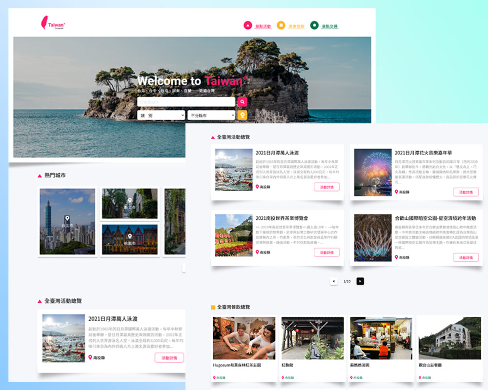

# The-F2E-3rd 修練精神時光屋第三屆－Week1 台灣旅遊景點導覽

這是來自[The-F2E-3rd](https://2021.thef2e.com/)的一個挑戰。The-F2E-3rd 是由[六角學院](https://www.hexschool.com/)主辦的一項競賽，主要是要提供給工程師、設計師一個可以練習專業技術的資源。目前 The-F2E 修練精神時光屋已經舉辦了三屆，有興趣的朋友也歡迎到連結中參考看看。

## 大綱

- [總覽](#總覽)
  - [關於這份挑戰](#關於這份挑戰)
  - [螢幕截圖](#螢幕截圖)
  - [網站連結](#網站連結)
- [使用的工具](#使用的工具)
- [更新紀錄](#更新紀錄)
- [我學到什麼](#我學到什麼)
- [特色](#特色)
- [問題回報](#問題回報)
- [關於作者](#關於作者)
- [致謝](#致謝)
- [參考資料](#參考資料)

## 總覽

### 關於這份挑戰

這份挑戰是要製作一個台灣旅遊景點導覽的網站，使用者應該要能夠：

- 在各種裝置上都能夠瀏覽該網站（手機、平板、電腦）
- 從清晰的圖文列表來導覽網站內容
- 透過篩選表單，來查看各縣市的的景點、活動、餐廳、旅宿
- 透過定位功能，來顯示附近的相關旅遊資訊

### 螢幕截圖

### 網站連結

The-F2E 挑戰連結：[這裡](#)

Demo 網站連結：[這裡](https://jubeatt.github.io/The-F2E-3rd-Travel-Guide/)

### 使用的工具

- [Vue.js](https://v3.vuejs.org/guide/introduction.html)
- CSS Flex-box
- SCSS
- BEM
- ES6
- RWD
- AJAX
- API（TDX 資料串接）
